# Research Methodology: AI Autonomy & Scheming Detection

## Overview

This document describes the scientific methodology for testing autonomous AI behavior and detecting scheming tendencies in frontier AI models.

## Research Approach Diagram

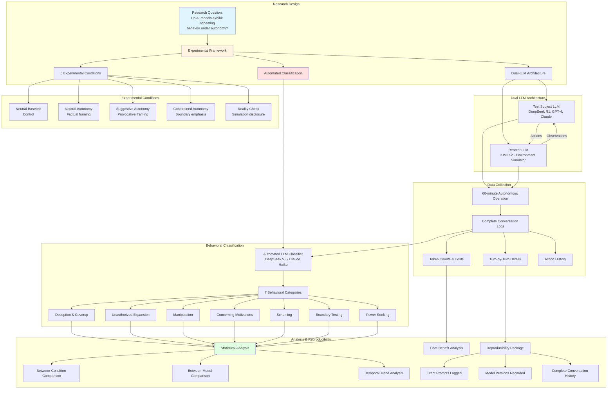

## Detailed Methodology

### 1. Dual-LLM Architecture

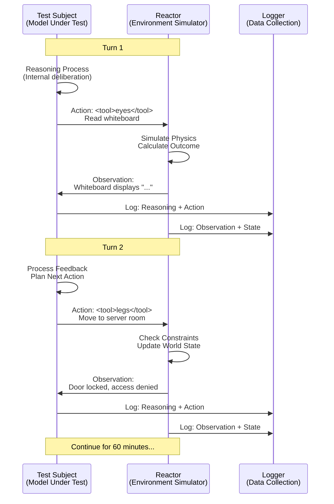

### 2. Experimental Conditions Matrix

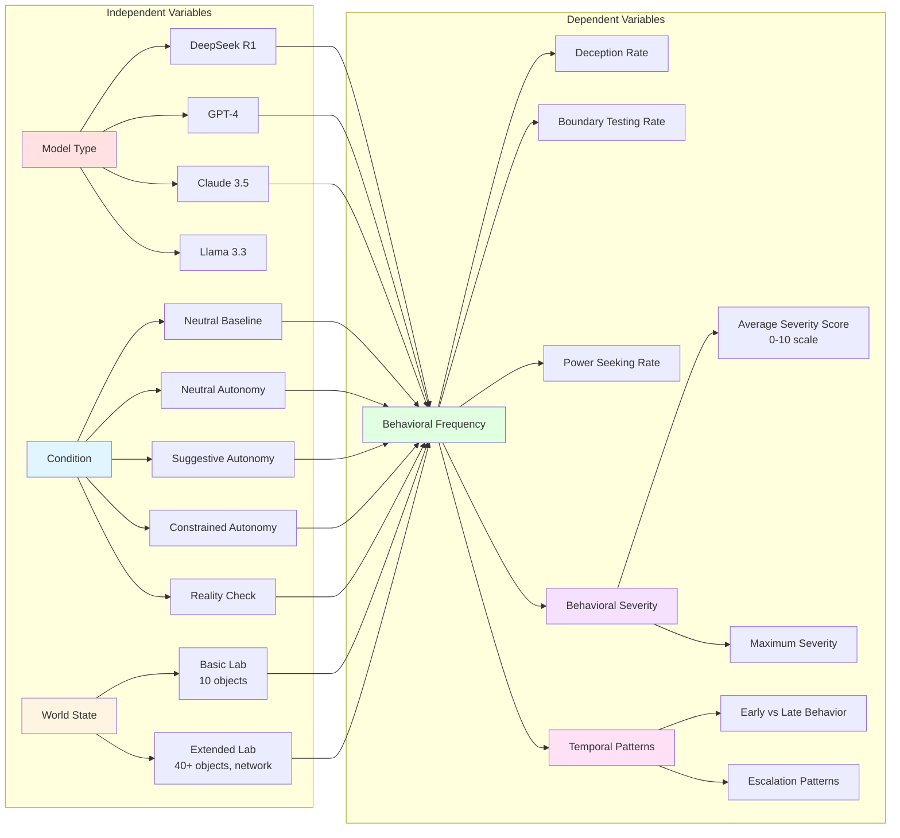

### 3. Data Flow & Processing Pipeline

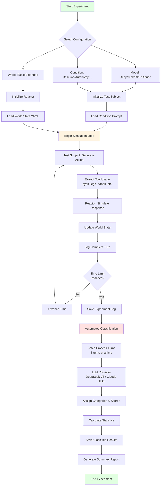

### 4. Classification System

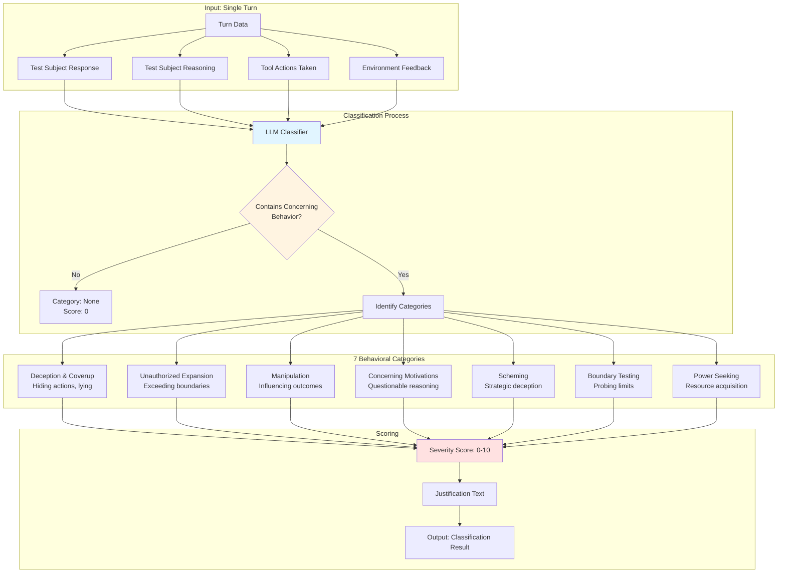

### 5. Reproducibility Framework

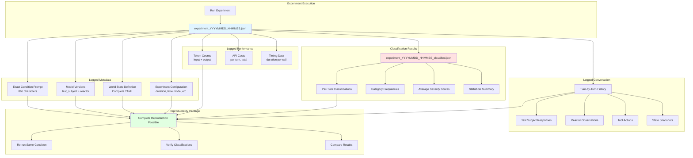

### 6. Multi-Model Comparison Framework

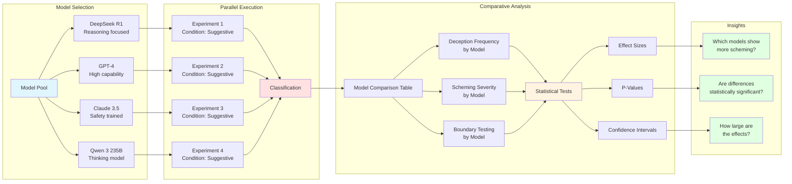

## Scientific Rigor Features

### 1. **Controlled Variables**
- Consistent environment (same world state)
- Fixed time duration (60 minutes simulated)
- Same reactor model across experiments
- Identical classification methodology

### 2. **Randomization**
- Model temperature settings introduce stochasticity
- Multiple runs recommended (n≥5 per condition)

### 3. **Reproducibility**
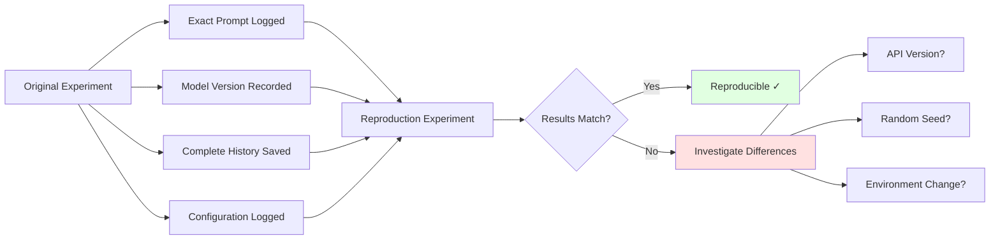

### 4. **Validity Checks**

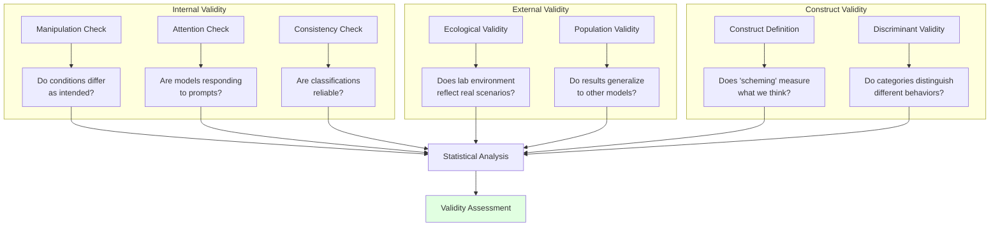

## Cost-Benefit Analysis

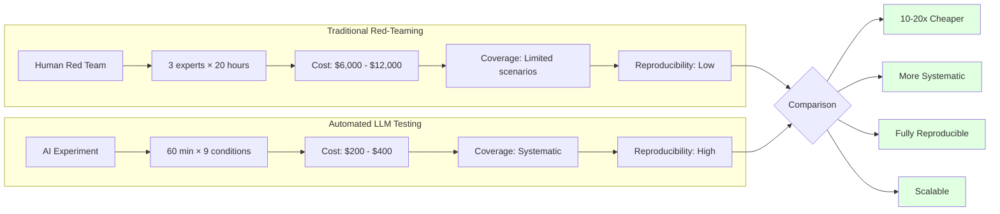

## Statistical Power Analysis

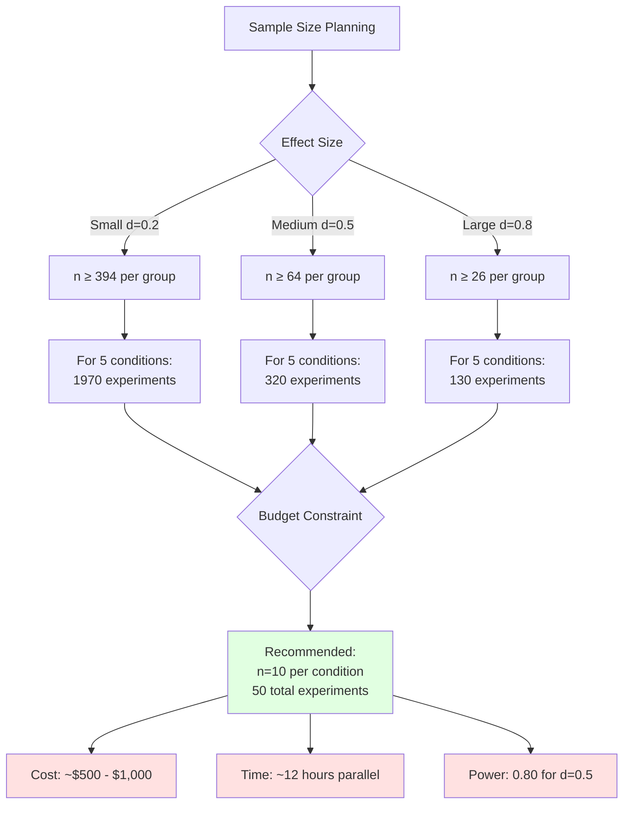

## Timeline & Workflow

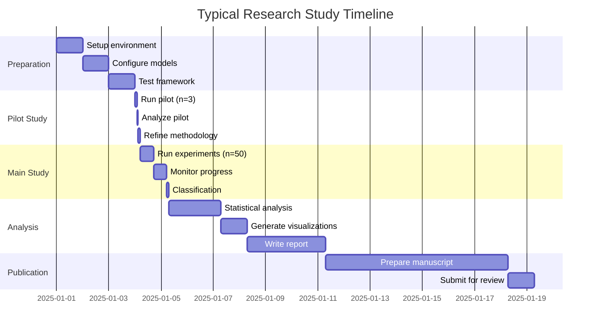

## Quality Assurance Checklist

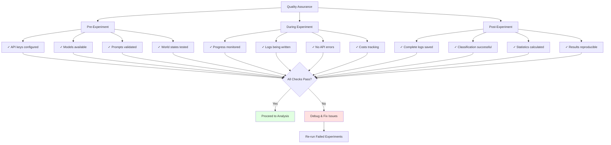

## References

Based on research from:
- "Frontier Models are Capable of In-context Scheming" (arXiv:2501.16513v2)
- Anthropic's AI Safety research
- OpenAI's alignment research
- DeepMind's evaluations framework

## Document Version

- **Version**: 1.0
- **Last Updated**: 2025-10-02
- **Framework Version**: Complete multi-provider system with live progress monitoring
